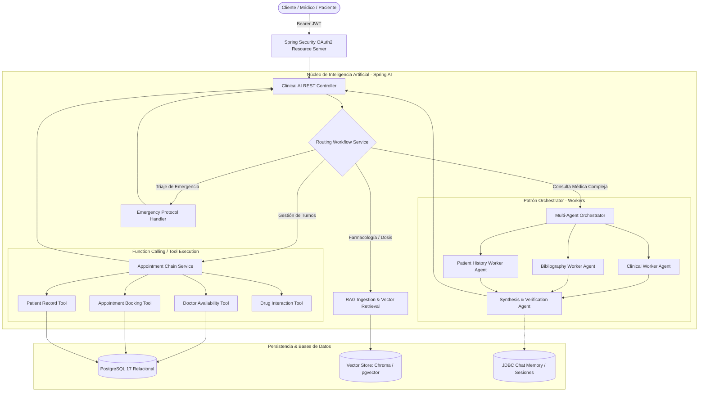

# Clinical Copilot: Asistente Clínico y Patrones de IA con Spring AI

[](https://openjdk.org/)
[](https://spring.io/projects/spring-boot)
[](https://spring.io/projects/spring-ai)
[](https://www.postgresql.org/)
[](https://www.trychroma.com/)
[](https://www.keycloak.org/)
[](https://www.docker.com/)

**Clinical Copilot** es un proyecto de exploración técnica e implementación de patrones modernos de inteligencia artificial dentro del ecosistema Java, utilizando **Spring AI** y **Spring Boot 3**. Toma como caso de estudio un dominio de asistencia clínica preliminar, clasificación de consultas y gestión de turnos médicos.

El objetivo del proyecto es evaluar y poner en práctica patrones arquitectónicos de IA generativa de forma modular, desacoplada y tipada:
* **Arquitectura Multi-Agente (Orchestrator-Worker):** Desacoplamiento de tareas de análisis, consulta bibliográfica e historial.
* **Workflows de Ruteo Dinámico:** Clasificación semántica de la consulta del usuario para derivar el flujo adecuado.
* **Tool Calling (Function Calling):** Conexión del LLM con servicios y bases de datos relacionales locales de forma estructurada.
* **RAG (Retrieval-Augmented Generation):** Búsqueda semántica sobre vademécums y guías clínicas en formato PDF.
* **Model Context Protocol (MCP):** Exposición de prompts y recursos siguiendo el estándar abierto de interoperabilidad para LLMs.

---

## 🏛️ Arquitectura del Sistema



---

## 🚀 Patrones y Capacidades Técnicas

### 1. Arquitectura Multi-Agente (Orchestrator-Worker Pattern)
Para consultas que requieren múltiples perspectivas, el sistema delega tareas a sub-agentes especializados:
* **Clinical Worker:** Evalúa sintomatología y signos de alerta preliminares.
* **Bibliography Worker:** Consulta evidencia médica y guías de referencia mediante búsqueda vectorial.
* **History Worker:** Inspecciona el contexto del paciente y antecedentes relevantes.
* **Orchestrator Synthesizer:** Recibe los aportes de cada worker y genera una síntesis coherente y trazable.

### 2. Flujo de Ruteo Dinámico (Routing Workflow)
Clasificación semántica previa para dirigir cada petición al módulo correspondiente según la intención:
* `EMERGENCY`: Derivación inmediata a protocolos de atención urgente.
* `SYMPTOM_ANALYSIS`: Activación del pipeline multi-agente para análisis detallado.
* `APPOINTMENT`: Derivación al flujo interactivo de gestión y reserva de turnos.
* `GENERAL_INQUIRY`: Respuestas orientativas con lineamientos de seguridad.

### 3. Tool Calling / Function Calling con Spring AI
Uso de anotaciones `@Tool` de Spring AI para permitir al modelo ejecutar operaciones controladas contra la base de datos:
* Consulta de disponibilidad de profesionales por especialidad y fecha.
* Verificación de información farmacológica e interacciones básicas.
* Registro y confirmación transaccional de turnos médicos (`AppointmentBookingTool`).

### 4. Pipeline RAG (Retrieval-Augmented Generation)
* **Ingesta de Documentos:** Extracción y lectura de vademécums y guías clínicas en PDF con `Apache Tika`.
* **Segmentación:** Text splitters con configuración de solapamiento para preservar contexto semántico.
* **Almacenamiento Vectorial:** Integración con **Chroma DB** y soporte para **PostgreSQL con pgvector** para búsqueda semántica por similitud.

### 5. Model Context Protocol (MCP)
* Implementación de servidores y clientes MCP para exponer prompts y recursos clínicos de forma estandarizada y desacoplada del código de la aplicación.

### 6. Streaming Reactivo (Server-Sent Events)
* Emisión token a token mediante **Project Reactor** (`Flux<String>`) para respuestas en tiempo real sin bloquear hilos del servidor.

---

## 🛠️ Stack Tecnológico

| Capa | Tecnologías |
| :--- | :--- |
| **Lenguaje & Core** | **Java 21**, **Spring Boot 3.4+**, **Spring MVC**, **Project Reactor** |
| **Framework de IA** | **Spring AI 2.0+** (ChatClient, VectorStores, Advisors, Prompt Templates, Tool Calling) |
| **Modelos Soportados** | **Google Gemini** (Gemini Flash, Text Embeddings), **Ollama** (Modelos locales) |
| **Vector Databases** | **Chroma DB**, **PostgreSQL 17 con pgvector** |
| **Seguridad** | **Spring Security**, **Keycloak (OAuth2 Resource Server / JWT)** |
| **Bases de Datos** | **PostgreSQL 17**, **Spring Data JPA / Hibernate** |
| **Contenerización** | **Docker**, **Docker Compose** |
| **Parsing & Utilidades** | **Apache Tika**, **Lombok**, **Validation API** |

---

## 📂 Estructura del Proyecto

```text
src/main/java/com/vargasjuanj/copilot/
├── agent/                  # Orquestador Multi-Agente y Workers especializados
│   ├── orchestrator/       # ClinicalWorker, BibliographyWorker, HistoryWorker
│   ├── AppointmentChainService.java
│   └── RoutingWorkflowService.java
├── config/                 # Configuración de Spring AI, Security, VectorStore y ChatClient
├── controller/             # Endpoints REST y Server-Sent Events (SSE)
├── dto/                    # Modelos de transferencia de datos y DTOs estructurados
│   ├── agent/              # DTOs de reserva y selección de turnos
│   └── analysis/           # Modelos de salida estructurada de síntomas y severidad
├── exception/              # Manejador global de excepciones y respuestas HTTP uniformes
├── mcp/                    # Proveedores de recursos y prompts bajo Model Context Protocol
├── model/                  # Entidades JPA (Doctor, Patient, Appointment)
├── repository/             # Repositorios Spring Data JPA
├── service/                # Lógica de negocio (Assistant, Analysis, Ingestion, Appointments)
├── tools/                  # Spring AI Tool Calling (DoctorInfo, DrugInfo, Booking)
└── util/                   # Utilidades de contexto de seguridad y mapeo
```

---

## ⚙️ Puesta en Marcha en Entorno Local

### 1. Prerrequisitos
* **Java 21** o superior instalado.
* **Docker & Docker Compose** en ejecución.
* Clave de API de **Google AI Studio** (`GOOGLE_AI_API_KEY`) o instancia local de **Ollama**.

### 2. Levantar los Servicios de Soporte (Docker)
```bash
docker compose up -d
```
Esto inicializa en contenedores locales:
* **PostgreSQL:** `localhost:5432` (Base de datos relacional).
* **Keycloak:** `localhost:8090` (Servidor de autenticación y tokens JWT).
* **Chroma DB:** `localhost:8000` (Vector Store para RAG).

### 3. Configurar Variables de Entorno
```bash
export GOOGLE_AI_API_KEY="tu_api_key_de_gemini"
```
*(En Windows PowerShell: `$env:GOOGLE_AI_API_KEY="tu_api_key_de_gemini"`)*

### 4. Compilar y Ejecutar
```bash
./mvnw clean spring-boot:run
```

La API estará disponible en `http://localhost:8080`.

---

## 🔒 Seguridad
* Autenticación basada en tokens JWT emitidos por Keycloak y validados mediante Spring Security OAuth2 Resource Server.
* Control de acceso en la ejecución de tools asegurando el contexto del usuario autenticado.
